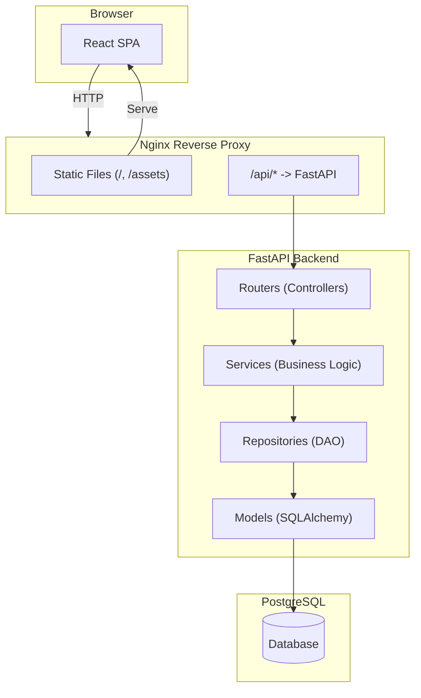

# EECS 4413 — Team To-Do & Project Guide

## Architecture Overview



## MVC + DAO Pattern Mapping

| Pattern Layer | Location | Description |
|---|---|---|
| **Model** | `backend/app/models/` + `backend/app/schemas/` | SQLAlchemy ORM tables + Pydantic request/response shapes |
| **View** | `frontend/src/` | React components and pages |
| **Controller** | `backend/app/routers/` | FastAPI route handlers |
| **DAO** | `backend/app/repositories/` | All database queries, abstracted behind repository classes |
| **Service** | `backend/app/services/` | Business logic sitting between controllers and DAOs |

---

## Project File Structure

```
EECS-4413/
├── frontend/                            # React (Vite + TypeScript)
│   ├── public/
│   ├── src/
│   │   ├── api/                         # Axios API client & per-domain functions
│   │   │   ├── client.ts                # Axios instance + auth interceptor
│   │   │   ├── auth.ts                  # register, login, getProfile, updateProfile
│   │   │   ├── catalog.ts               # getItems, getItem
│   │   │   ├── cart.ts                  # getCart, addToCart, updateCartItem, removeFromCart
│   │   │   ├── orders.ts                # checkout, getOrders
│   │   │   └── admin.ts                 # getSalesHistory, getInventory, addItem, updateItem, getUsers
│   │   ├── components/
│   │   │   ├── common/                  # Navbar, Button, Input, Modal, LoadingSpinner
│   │   │   ├── catalog/                 # ProductCard, ProductGrid, FilterBar, SortControl, SearchBar
│   │   │   ├── cart/                    # CartItemRow, CartSummary
│   │   │   ├── checkout/                # PaymentForm, ShippingForm, OrderSummary
│   │   │   ├── auth/                    # LoginForm, RegisterForm, ProtectedRoute, AdminRoute
│   │   │   └── admin/                   # InventoryTable, AddItemForm, EditItemModal, SalesTable, UserTable
│   │   ├── pages/
│   │   │   ├── CatalogPage.tsx          # Main store view with filters/search/sort
│   │   │   ├── ProductDetailPage.tsx    # Single product detail + add to cart
│   │   │   ├── CartPage.tsx             # Cart review, edit quantities, checkout button
│   │   │   ├── CheckoutPage.tsx         # Payment form, shipping, confirm order
│   │   │   ├── LoginPage.tsx            # Email + password login
│   │   │   ├── RegisterPage.tsx         # New account form
│   │   │   ├── ProfilePage.tsx          # User info + purchase history
│   │   │   ├── OrderConfirmationPage.tsx # Post-checkout order summary
│   │   │   └── admin/
│   │   │       ├── DashboardPage.tsx    # Admin overview + quick links
│   │   │       ├── InventoryPage.tsx    # View/add/edit products
│   │   │       ├── SalesHistoryPage.tsx # View all orders
│   │   │       └── UsersPage.tsx        # View/edit user accounts
│   │   ├── context/
│   │   │   ├── AuthContext.tsx          # Global auth state (user, login, logout, register)
│   │   │   └── CartContext.tsx          # Global cart state (items, total, add/remove/update)
│   │   ├── hooks/
│   │   │   ├── useAuth.ts               # Convenience hook for AuthContext
│   │   │   └── useCart.ts               # Convenience hook for CartContext
│   │   ├── types/
│   │   │   └── index.ts                 # TypeScript interfaces (User, Item, Cart, Order, etc.)
│   │   ├── utils/
│   │   │   └── formatters.ts            # formatCurrency, formatDate
│   │   ├── App.tsx                      # Route tree + provider wrappers
│   │   └── main.tsx                     # React entry point
│   ├── index.html
│   ├── package.json
│   ├── tsconfig.json
│   ├── vite.config.ts
│   └── Dockerfile
├── backend/
│   ├── app/
│   │   ├── main.py                      # FastAPI app init, CORS, router registration
│   │   ├── config.py                    # Pydantic Settings (DB URL, JWT secret, etc.)
│   │   ├── database.py                  # SQLAlchemy engine, SessionLocal, Base
│   │   ├── dependencies.py              # get_db() session dependency
│   │   ├── models/
│   │   │   ├── user.py                  # User table
│   │   │   ├── item.py                  # Item/Product table
│   │   │   ├── address.py               # Address table
│   │   │   ├── cart.py                  # ShoppingCart + CartItem tables
│   │   │   └── order.py                 # PurchaseOrder + OrderItem tables
│   │   ├── schemas/
│   │   │   ├── user.py                  # UserCreate, UserLogin, UserUpdate, UserResponse, Token
│   │   │   ├── item.py                  # ItemCreate, ItemUpdate, ItemResponse
│   │   │   ├── cart.py                  # CartItemAdd, CartItemUpdate, CartResponse
│   │   │   └── order.py                 # CheckoutRequest, OrderResponse
│   │   ├── repositories/
│   │   │   ├── base_repository.py       # Generic CRUD: get_by_id, get_all, create, update, delete
│   │   │   ├── user_repository.py       # get_by_email
│   │   │   ├── item_repository.py       # get_by_category, get_by_brand, search
│   │   │   ├── cart_repository.py       # get_by_user_id, get_cart_item, add/remove/clear
│   │   │   └── order_repository.py      # get_by_customer_id
│   │   ├── services/
│   │   │   ├── auth_service.py          # register, login
│   │   │   ├── catalog_service.py       # list_items (filter/sort), get_item
│   │   │   ├── cart_service.py          # get_or_create_cart, add/update/remove/clear
│   │   │   ├── order_service.py         # checkout, get_orders, get_all_orders
│   │   │   └── payment_service.py       # process_payment (mock — deny every 3rd)
│   │   ├── routers/
│   │   │   ├── auth.py                  # POST /api/auth/register, /api/auth/login
│   │   │   ├── catalog.py               # GET /api/catalog, /api/catalog/{id}
│   │   │   ├── cart.py                  # GET/POST/PUT/DELETE /api/cart
│   │   │   ├── orders.py                # POST /api/orders/checkout, GET /api/orders
│   │   │   ├── users.py                 # GET/PUT /api/users/me
│   │   │   └── admin.py                 # GET/POST/PUT /api/admin/*
│   │   └── utils/
│   │       └── security.py              # hash_password, verify_password, create_access_token, get_current_user
│   ├── tests/
│   │   ├── conftest.py                  # Test DB, TestClient, fixtures
│   │   ├── test_auth.py
│   │   ├── test_catalog.py
│   │   ├── test_cart.py
│   │   └── test_orders.py
│   ├── alembic/                         # DB migration scripts
│   │   ├── env.py
│   │   ├── script.py.mako
│   │   └── versions/
│   ├── alembic.ini
│   ├── requirements.txt
│   └── Dockerfile
├── nginx/
│   ├── nginx.conf                       # Serve static files + proxy /api/* to backend
│   └── Dockerfile
├── docker-compose.yml                   # All 4 services: frontend, backend, nginx, db
├── .env.example                         # Copy to .env before running
├── .gitignore
└── README.md
```

---

## Team To-Do List

> Each checkbox is one unit of work. Assign your name next to items you're taking.
> Files are already stubbed — every method has a docstring explaining what to implement.

---

### Member 1 — Frontend: Pages & Components

#### Setup
- [ ] Run `npm install` in `frontend/`
- [ ] Verify dev server starts: `npm run dev` → http://localhost:5173

#### Types & Utils
- [ ] `src/types/index.ts` — uncomment and finalize all interfaces (User, Item, Cart, Order, Token)
- [ ] `src/utils/formatters.ts` — implement `formatCurrency()` and `formatDate()`

#### API Layer
- [ ] `src/api/client.ts` — create Axios instance with `/api` base URL + JWT interceptor
- [ ] `src/api/auth.ts` — implement `register`, `login`, `getProfile`, `updateProfile`
- [ ] `src/api/catalog.ts` — implement `getItems`, `getItem`
- [ ] `src/api/cart.ts` — implement `getCart`, `addToCart`, `updateCartItem`, `removeFromCart`
- [ ] `src/api/orders.ts` — implement `checkout`, `getOrders`
- [ ] `src/api/admin.ts` — implement all admin API functions

#### Context & Hooks
- [ ] `src/context/AuthContext.tsx` — implement `AuthProvider` with login/logout/register + session restore
- [ ] `src/context/CartContext.tsx` — implement `CartProvider` with cart sync + derived state
- [ ] `src/hooks/useAuth.ts` — implement `useAuth` hook
- [ ] `src/hooks/useCart.ts` — implement `useCart` hook

#### Entry Point & Routing
- [ ] `src/main.tsx` — render `<BrowserRouter><App /></BrowserRouter>` into `#root`
- [ ] `src/App.tsx` — wrap providers, define all routes, add `ProtectedRoute` + `AdminRoute` guards

#### Common Components (`src/components/common/`)
- [ ] `Navbar` — links to Home, Cart (with item count badge), Login/Logout, Profile, Admin
- [ ] `ProtectedRoute` — redirect to `/login` if not authenticated
- [ ] `AdminRoute` — redirect to `/` if not admin

#### Catalog Components (`src/components/catalog/`)
- [ ] `ProductCard` — image, name, price, "Add to Cart" button
- [ ] `ProductGrid` — responsive grid layout of ProductCards
- [ ] `SearchBar` — controlled input, calls onSearch callback
- [ ] `FilterBar` — category and brand dropdowns
- [ ] `SortControl` — sort by price/name, asc/desc toggle

#### Cart Components (`src/components/cart/`)
- [ ] `CartItemRow` — product name, unit price, quantity +/- controls, subtotal, remove button
- [ ] `CartSummary` — total price, "Continue Shopping" link, "Checkout" button

#### Checkout Components (`src/components/checkout/`)
- [ ] `PaymentForm` — credit card number, expiry, CVV fields
- [ ] `ShippingForm` — address fields
- [ ] `OrderSummary` — line items, total, "Confirm Order" submit button

#### Auth Components (`src/components/auth/`)
- [ ] `LoginForm` — email + password fields + submit
- [ ] `RegisterForm` — full registration fields + submit

#### Admin Components (`src/components/admin/`)
- [ ] `InventoryTable` — sortable table of products with edit buttons
- [ ] `AddItemForm` — form to add a new product
- [ ] `EditItemModal` — modal to update an existing product
- [ ] `SalesTable` — table of orders with expandable rows
- [ ] `UserTable` — table of users with edit buttons

#### Pages
- [ ] `CatalogPage.tsx` — fetch + display items with filter/search/sort controls
- [ ] `ProductDetailPage.tsx` — fetch single item, show details, add to cart
- [ ] `CartPage.tsx` — display cart, edit quantities, navigate to checkout
- [ ] `CheckoutPage.tsx` — payment + shipping form, handle 402 denial gracefully
- [ ] `LoginPage.tsx` — login form, redirect after success
- [ ] `RegisterPage.tsx` — register form, auto-login after success
- [ ] `ProfilePage.tsx` — editable profile + purchase history list
- [ ] `OrderConfirmationPage.tsx` — display completed order summary
- [ ] `admin/DashboardPage.tsx` — admin overview with navigation cards
- [ ] `admin/InventoryPage.tsx` — inventory table + add/edit item forms
- [ ] `admin/SalesHistoryPage.tsx` — all orders table with filter + row expand
- [ ] `admin/UsersPage.tsx` — all users table with edit controls

---

### Member 2 — Backend: Routers & Services

#### Setup
- [ ] Create and activate virtual environment: `python -m venv venv && source venv/bin/activate`
- [ ] Install dependencies: `pip install -r requirements.txt`
- [ ] Copy `.env.example` to `.env`, fill in values

#### Infrastructure
- [ ] `app/config.py` — implement `Settings` class (pydantic-settings, load from `.env`)
- [ ] `app/database.py` — create `engine`, `SessionLocal`, `Base`
- [ ] `app/dependencies.py` — implement `get_db()` generator
- [ ] `app/main.py` — init FastAPI app, add CORS middleware, register all routers

#### Security Utilities
- [ ] `app/utils/security.py` — implement `hash_password`, `verify_password`, `create_access_token`, `get_current_user`

#### Services
- [ ] `app/services/auth_service.py` — implement `register()` and `login()`
- [ ] `app/services/catalog_service.py` — implement `list_items()` with filter/sort logic and `get_item()`
- [ ] `app/services/cart_service.py` — implement `get_or_create_cart`, `add_item`, `update_item`, `remove_item`, `clear`
- [ ] `app/services/order_service.py` — implement `checkout` (inventory check, payment, order creation) and `get_orders`, `get_all_orders`
- [ ] `app/services/payment_service.py` — implement `process_payment` mock (deny every 3rd call)

#### Routers (Controllers)
- [ ] `app/routers/auth.py` — wire up `register` and `login` endpoints with correct decorators
- [ ] `app/routers/catalog.py` — wire up `list_items` and `get_item` with Query params
- [ ] `app/routers/cart.py` — wire up all cart endpoints with `Depends(get_current_user)`
- [ ] `app/routers/orders.py` — wire up `checkout` and `get_my_orders` with auth
- [ ] `app/routers/users.py` — wire up `get_profile` and `update_profile` with auth
- [ ] `app/routers/admin.py` — wire up all admin endpoints with `Depends(require_admin)`

---

### Member 3 — Backend: Models, Schemas, DAO & Migrations

#### Setup
- [ ] Same venv setup as Member 2 (share environment)
- [ ] Confirm PostgreSQL is running (via Docker or local install)

#### Models
- [ ] `app/models/user.py` — implement `User` ORM class with all columns and relationships
- [ ] `app/models/item.py` — implement `Item` ORM class
- [ ] `app/models/address.py` — implement `Address` ORM class with `users` relationship
- [ ] `app/models/cart.py` — implement `ShoppingCart` and `CartItem` ORM classes
- [ ] `app/models/order.py` — implement `PurchaseOrder` and `OrderItem` ORM classes
- [ ] `app/models/__init__.py` — import all models so they register with `Base.metadata`

#### Schemas
- [ ] `app/schemas/user.py` — implement `UserCreate`, `UserLogin`, `UserUpdate`, `UserResponse`, `Token`
- [ ] `app/schemas/item.py` — implement `ItemCreate`, `ItemUpdate`, `ItemResponse`
- [ ] `app/schemas/cart.py` — implement `CartItemAdd`, `CartItemUpdate`, `CartItemResponse`, `CartResponse`
- [ ] `app/schemas/order.py` — implement `CheckoutRequest`, `OrderItemResponse`, `OrderResponse`

#### Repositories (DAO)
- [ ] `app/repositories/base_repository.py` — implement generic `BaseRepository` with `get_by_id`, `get_all`, `create`, `update`, `delete`
- [ ] `app/repositories/user_repository.py` — implement `get_by_email`
- [ ] `app/repositories/item_repository.py` — implement `get_by_category`, `get_by_brand`, `search`
- [ ] `app/repositories/cart_repository.py` — implement `get_by_user_id`, `get_cart_item`, `add_cart_item`, `remove_cart_item`, `clear_cart`
- [ ] `app/repositories/order_repository.py` — implement `get_by_customer_id`

#### Database Migrations (Alembic)
- [ ] `alembic/env.py` — configure `target_metadata`, connect to DB via `settings.DATABASE_URL`
- [ ] Generate initial migration: `alembic revision --autogenerate -m "initial tables"`
- [ ] Apply migration: `alembic upgrade head`
- [ ] Verify all tables exist in PostgreSQL
- [ ] Seed sample product data (at least 10 items across 3+ categories for testing)

---

### Member 4 — DevOps: Docker, Nginx, Deployment & Testing

#### Docker & Nginx
- [ ] Verify `backend/Dockerfile` builds cleanly: `docker build -t estore-backend ./backend`
- [ ] Verify `frontend/Dockerfile` builds cleanly: `docker build -t estore-frontend ./frontend`
- [ ] Verify `nginx/Dockerfile` builds cleanly
- [ ] Test full stack: `cp .env.example .env && docker compose up --build`
- [ ] Confirm frontend loads at http://localhost
- [ ] Confirm backend API responds at http://localhost/api/health
- [ ] Tune `nginx/nginx.conf` if needed (timeouts, file upload size for product images)

#### Testing
- [ ] `tests/conftest.py` — implement test DB setup, TestClient fixture, `sample_user` fixture, `auth_headers` fixture
- [ ] `tests/test_auth.py` — implement all 5 auth test cases
- [ ] `tests/test_catalog.py` — implement all 8 catalog test cases (seed items in fixture)
- [ ] `tests/test_cart.py` — implement all 6 cart test cases
- [ ] `tests/test_orders.py` — implement all 6 order/checkout test cases
- [ ] Run full test suite: `pytest tests/ -v`
- [ ] Aim for all tests passing before submission

#### Deployment (Cloud or Docker)
- [ ] Choose deployment target: AWS / GCP / Render / Railway / local Docker
- [ ] Set production environment variables (real `JWT_SECRET`, DB credentials)
- [ ] Deploy and verify public URL is accessible
- [ ] Document deployment steps in `README.md`

---

## Getting Started (All Members)

```bash
# 1. Clone the repo
git clone <your-org-repo-url>
cd EECS-4413

# 2. Set up environment variables
cp .env.example .env
# Edit .env with your DB credentials and a random JWT_SECRET

# 3a. Run everything with Docker (recommended)
docker compose up --build

# 3b. OR run services locally for development:

# Backend
cd backend
python -m venv venv && source venv/bin/activate
pip install -r requirements.txt
alembic upgrade head
uvicorn app.main:app --reload
# API docs at http://localhost:8000/docs

# Frontend (new terminal)
cd frontend
npm install
npm run dev
# App at http://localhost:5173
```

---

## Key Design Decisions (for the Report)

| Decision | Choice | Rationale |
|---|---|---|
| Frontend framework | React + TypeScript (Vite) | Component-based SPA, strong typing, fast dev server |
| Backend framework | Python FastAPI | Auto-generates OpenAPI docs, async-ready, type-safe via Pydantic |
| Database | PostgreSQL 16 | Relational, ACID-compliant, required by project schema |
| ORM | SQLAlchemy | DAO pattern maps cleanly to repository classes |
| Auth | JWT (python-jose) | Stateless, works well with SPAs |
| Reverse proxy | Nginx | Serves static files + proxies API, standard for this stack |
| Containerization | Docker Compose | Reproducible environment for development and deployment |
| Migration tool | Alembic | Autogenerates migrations from SQLAlchemy models |

---

## API Quick Reference

| Method | Path | Auth | Description |
|---|---|---|---|
| POST | `/api/auth/register` | — | Create new account |
| POST | `/api/auth/login` | — | Login, receive JWT |
| GET | `/api/catalog` | — | List products (filter/sort/search) |
| GET | `/api/catalog/{id}` | — | Single product detail |
| GET | `/api/cart` | User | Get current cart |
| POST | `/api/cart/items` | User | Add item to cart |
| PUT | `/api/cart/items/{id}` | User | Update cart item quantity |
| DELETE | `/api/cart/items/{id}` | User | Remove item from cart |
| POST | `/api/orders/checkout` | User | Checkout + payment |
| GET | `/api/orders` | User | Purchase history |
| GET | `/api/users/me` | User | Get profile |
| PUT | `/api/users/me` | User | Update profile |
| GET | `/api/admin/sales` | Admin | All sales history |
| GET | `/api/admin/inventory` | Admin | All products |
| POST | `/api/admin/inventory` | Admin | Add new product |
| PUT | `/api/admin/inventory/{id}` | Admin | Update product |
| GET | `/api/admin/users` | Admin | All user accounts |
